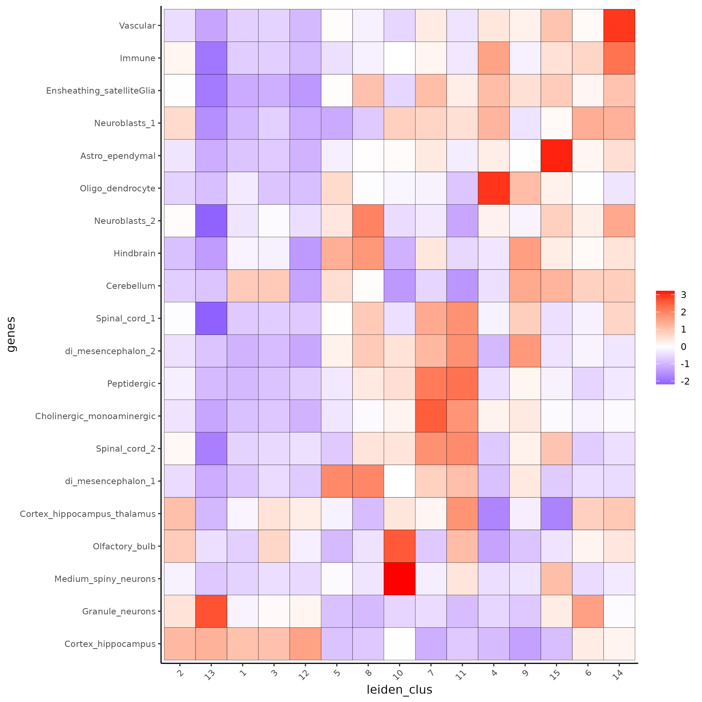

Technologies like Visium spatial transcriptomics does not provide single-cell resolution, making cell type annotation a harder problem.   
One barcode of these spatial datasets can be made up of different cell types.   

To solve this problem, Giotto provides several ways to calculate enrichment of specific cell-type signature gene list:    
Spatial Enrichment:     
- [PAGE](https://bmcbioinformatics.biomedcentral.com/articles/10.1186/1471-2105-6-144)      
- hypergeometric test   
- Rank   
Spatial Deconvolution:    
- [DWLS Deconvolution](https://genomebiology.biomedcentral.com/articles/10.1186/s13059-021-02362-7) 

The deconvolution analysis is also a good way to integrate single cell RNAseq data with spatial transcriptomics datasets.   
In this example, Corresponded Single cell dataset can be generated from [here](http://mousebrain.org/downloads.html).   
Giotto_SC is processed from the downsampled [Loom](https://satijalab.org/loomr/loomr_tutorial) file.   


###  PAGE enrichment 
```{r eval = FALSE}
# Create PAGE matrix
# PAGE matrix should be a binary matrix with each row represent a gene marker and each column represent a cell type
# There are several ways to create PAGE matrix
# 1.1 create binary matrix of cell signature genes
# small example #
gran_markers = c("Nr3c2", "Gabra5", "Tubgcp2", "Ahcyl2",
                 "Islr2", "Rasl10a", "Tmem114", "Bhlhe22", 
                 "Ntf3", "C1ql2")

oligo_markers = c("Efhd1", "H2-Ab1", "Enpp6", "Ninj2",
                  "Bmp4", "Tnr", "Hapln2", "Neu4",
                  "Wfdc18", "Ccp110")        

di_mesench_markers = c("Cartpt", "Scn1a", "Lypd6b",  "Drd5",
                       "Gpr88", "Plcxd2", "Cpne7", "Pou4f1",
                       "Ctxn2", "Wnt4")

PAGE_matrix_1 = makeSignMatrixPAGE(sign_names = c('Granule_neurons',
                                                     'Oligo_dendrocytes',
                                                     'di_mesenchephalon'),
                                      sign_list = list(gran_markers,
                                                       oligo_markers,
                                                       di_mesench_markers))


# ----

# 1.2 [shortcut] fully pre-prepared matrix for all cell types
sign_matrix_path = system.file("extdata", "sig_matrix.txt", package = 'Giotto')
brain_sc_markers = data.table::fread(sign_matrix_path) 
PAGE_matrix_2 = as.matrix(brain_sc_markers[,-1])
rownames(PAGE_matrix_2) = brain_sc_markers$Event


# ---

# 1.3 make PAGE matrix from single cell dataset
markers_scran = findMarkers_one_vs_all(gobject=giotto_SC, method="scran",
                                       expression_values="normalized", cluster_column='prostate_labels', min_feats=3)
top_markers <- markers_scran[, head(.SD, 10), by="cluster"]
celltypes<-levels(factor(markers_scran$cluster)) 
sign_list<-list()
for (i in 1:length(celltypes)){
    sign_list[[i]]<-top_markers[which(top_markers$cluster == celltypes[i]),]$gene
}

PAGE_matrix_3 = makeSignMatrixPAGE(sign_names = celltypes,
                                      sign_list = sign_list)

# 1.4 enrichment test with PAGE

# runSpatialEnrich() can also be used as a wrapper for all currently provided enrichment options
visium_brain = runPAGEEnrich(gobject = visium_brain, sign_matrix = PAGE_matrix_2)


# 1.5 heatmap of enrichment versus annotation (e.g. clustering result)
cell_types_PAGE = colnames(PAGE_matrix_2)
plotMetaDataCellsHeatmap(gobject = visium_brain,
                         metadata_cols = 'leiden_clus',
                         value_cols = cell_types_PAGE,
                         spat_enr_names = 'PAGE',
                         x_text_size = 8, 
                         y_text_size = 8,
                         save_param = list(save_name="7_a_metaheatmap"))
```
{ width=50% } 

PAGE enrichment stats will be stored in the giotto_object@spatial_enrichment$PAGE slot. The enrichment result can be visualized by spatplot by adding the spat_enr_names argument.
```{r eval = FALSE}
# 1.6 visualizations
spatCellPlot2D(gobject = visium_brain, 
             spat_enr_names = 'PAGE',
             cell_annotation_values = cell_types_PAGE[1:4],
             cow_n_col = 2,coord_fix_ratio = NULL, point_size = 0.75, show_legend = F,
             save_param = list(save_name="7_b_spatcellplot_1"))
```
{ width=50% }  


```{r eval = FALSE}
spatDimCellPlot2D(gobject = visium_brain, 
                spat_enr_names = 'PAGE',
                cell_annotation_values = cell_types_PAGE[1:4],
                cow_n_col = 1, spat_point_size = 1, 
                plot_alignment = 'horizontal', 
                save_param = list(save_name="7_d_spatDimCellPlot", base_width=7, base_height=10))
```
{ width=50% } 


###  HyperGeometric test
```{r eval = FALSE}
#Modify the sparse matrix in normalized slot
visium_brain@expression$rna$normalized <- as.matrix(visium_brain@expression$rna$normalized)
visium_brain = runHyperGeometricEnrich(gobject = visium_brain,
                                    expression_values = "normalized",
                                    sign_matrix = PAGE_matrix_3)
cell_types_HyperGeometric = colnames(PAGE_matrix_3)
```

HyperGeometric enrichment stats will be stored in the giotto_object@spatial_enrichment$hypergeometric slot. The enrichment result can be visualized by spatplot by adding the spat_enr_names argument.
```{r eval = FALSE}
spatCellPlot(gobject = visium_brain, 
             spat_enr_names = 'hypergeometric',
             cell_annotation_values = cell_types_HyperGeometric[1:4],
             cow_n_col = 2,coord_fix_ratio = NULL, point_size = 1.75,
             save_param = list(save_name = "7.2b_HyperGeometric_plot"))

```
{ width=50% } 


### Rank
This algorithm calculates gene signature enrichment scores per spatial position using a rank based approach.
Rank enrichment stats will be stored in the giotto_object@spatial_enrichment$rank slot. The enrichment result can be visualized by spatplot by adding the spat_enr_names argument.
```{r eval = FALSE}
rank_matrix = makeSignMatrixRank(sc_matrix = as.matrix(giotto_SC@expression$rna$normalized),
                                 sc_cluster_ids = pDataDT(giotto_SC)$Class)
colnames(rank_matrix)<-levels(factor(pDataDT(giotto_SC)$Class))

visium_brain = runRankEnrich(gobject = visium_brain, sign_matrix = rank_matrix,expression_values = "normalized")
spatCellPlot2D(gobject = visium_brain, 
             spat_enr_names = 'rank',
             cell_annotation_values = colnames(rank_matrix)[1:4],
             cow_n_col = 2,coord_fix_ratio = NULL, point_size = 1,
             save_param = list(save_name = "7.3a_Rank_plot"))
```
{ width=50% } 

### Deconvolution
DWLS deconvolution stats will be stored in the giotto_object@spatial_enrichment$DWLS slot. The enrichment result can be visualized by spatplot by adding the spat_enr_names argument.
```{r eval = FALSE}
DWLS_matrix<-makeSignMatrixDWLSfromMatrix(matrix = as.matrix(giotto_SC@expression$rna$normalized), 
                                cell_type = pDataDT(giotto_SC)$brain_label,
                                sign_gene = top_markers$gene)
visium_brain = runDWLSDeconv(gobject = visium_brain, sign_matrix = DWLS_matrix)
spatCellPlot2D(gobject = visium_brain, 
             spat_enr_names = 'DWLS',
             cell_annotation_values = colnames(DWLS_matrix)[1:4],
             cow_n_col = 2,coord_fix_ratio = NULL, point_size = 1,
             save_param = list(save_name = "7.4_DWLS_plot"))
```
{ width=50% } 
