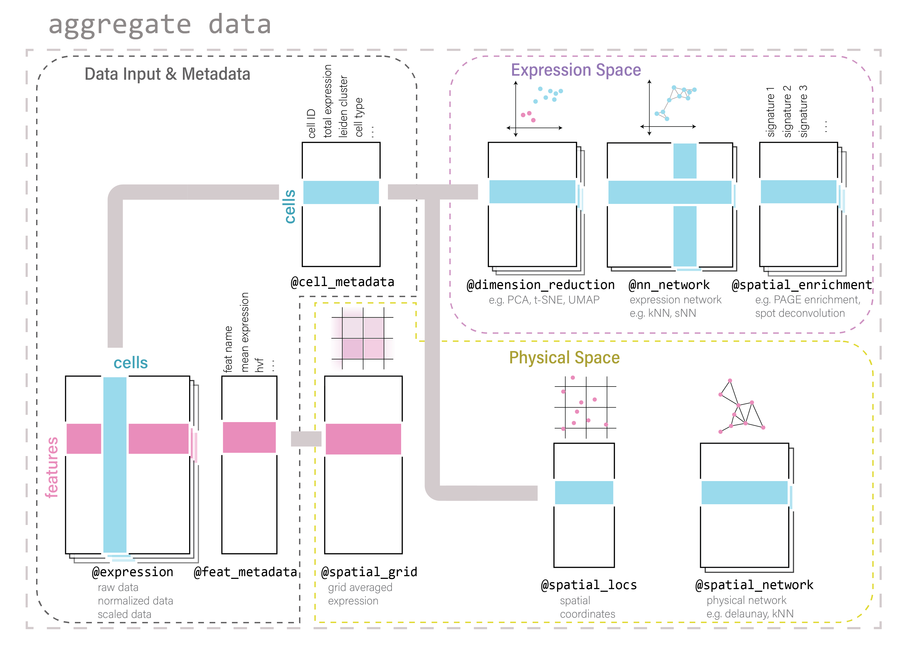

# Giotto Object Structure
<br>
Usage of the Giotto package revolves around the **giottoObject**. This is an S4 object class that holds spatial expression data and facilitates its use with the Giotto package's functions. Additional metadata and other certain outputs generated from Giotto functions that are used in downstream analyses will also be stored within this object. The self-contained nature of the Giotto object makes it a convenient representation of the entire spatial experiment and is why many of Giotto functions both take the **giottoObject** as input and feed into it as output.    

Data is organized within the **giottoObject** in defined **slots** as described in the diagram below.    
<br>
{width=100%}  
{width=100%}  
{width=100%}  
    
## Nested organization within slots    
Spatial data has a tiered organization and so does Giotto. Tissue regions can be divided down into individual cells and then further into organelles. The data structure of Giotto mirrors biological structure by nesting data within slots related to spatial data by **spat_unit** (spatial unit).
<br>    
To facilitate the integration of multiple omic data, slots related to feature data will be nested with **feat_type** (feature type).
<br>    
    
```{r include=FALSE}
# Code snippet from https://bookdown.org/yihui/rmarkdown-cookbook/font-color.html
colorize <- function(x, color) {
  if (knitr::is_latex_output()) {
    sprintf("\\textcolor{%s}{%s}", color, x)
  } else if (knitr::is_html_output()) {
    sprintf("<span style='color: %s;'>%s</span>", color,
      x)
  } else x
}
```


### Slots and Subnesting    
Slot                       Nested                                                                                                                                  Example                                                                                                                                                            Accessors
------------------------   -------------------------------------------------------------------------------------------------------------------------------------   ---------------------------------------------------------------------------------------------------------------------------------------------------------------    -----------------------------------------------------------------------------------
**@expression**            `r colorize("spat_unit", "#4C94A0")`-`r colorize("feat_type", "#E88EBB")`-`r colorize("data", "#A99F34")`                               `r colorize("cell", "#4C94A0")`-`r colorize("rna", "#E88EBB")`-`r colorize("raw", "#A99F34")`                                                                      get_expression_values()<br>set_expression_values()<br>showGiottoExpression()
**@cell_metadata**         `r colorize("spat_unit", "#4C94A0")`-`r colorize("feat_type", "#E88EBB")`                                                               `r colorize("cell", "#4C94A0")`-`r colorize("rna", "#E88EBB")`                                                                                                     pDataDT()<br>addCellMetadata()
**@feat_metadata**         `r colorize("spat_unit", "#4C94A0")`-`r colorize("feat_type", "#E88EBB")`                                                               `r colorize("cell", "#4C94A0")`-`r colorize("rna", "#E88EBB")`                                                                                                     fDataDT()<br>addFeatMetadata()
**@spatial_grid**          `r colorize("spat_unit", "#4C94A0")`-`r colorize("feat_type", "#E88EBB")`                                                               `r colorize("cell", "#4C94A0")`-`r colorize("rna", "#E88EBB")`                                                                                                     get_spatialGrid()<br>set_spatialGrid()<br>showGiottoSpatGrids()
**@nn_network**            `r colorize("spat_unit", "#4C94A0")`-`r colorize("method", "#F6851F")`-`r colorize("name", "#801C34")`                                  `r colorize("cell", "#4C94A0")`-`r colorize("SNN", "#F6851F")`-`r colorize("SNN_results1", "#801C34")`                                                             get_NearestNetwork()<br>set_NearestNetwork()
**@dimension_reduction**   `r colorize("spat_unit", "#4C94A0")`-`r colorize("method", "#F6851F")`-`r colorize("name", "#801C34")`                                  `r colorize("cell", "#4C94A0")`-`r colorize("PCA", "#F6851F")`-`r colorize("pca_results1", "#801C34")`                                                             get_dimReduction()<br>set_dimReduction()<br>showGiottoDimRed()
**@spatial_enrichment**    `r colorize("spat_unit", "#4C94A0")`-`r colorize("name", "#801C34")`                                                                    `r colorize("cell", "#4C94A0")`-`r colorize("results1", "#801C34")`                                                                                                get_spatial_enrichment()<br>set_spatial_enrichment()<br>showGiottoSpatEnrichments()
**@spatial_info**          `r colorize("spat_unit", "#4C94A0")`                                                                                                    `r colorize("cell", "#4C94A0")`                                                                                                                                    get_polygon_info()<br>set_polygon_info()<br>showGiottoSpatialInfo()
**@spatial_locs**          `r colorize("spat_unit", "#4C94A0")`-`r colorize("name", "#801C34")`                                                                    `r colorize("cell", "#4C94A0")`-`r colorize("raw", "#801C34")`                                                                                                     get_spatial_locations()<br>set_spatial_locations()<br>showGiottoSpatLocs()
**@spatial_network**       `r colorize("spat_unit", "#4C94A0")`-`r colorize("name", "#801C34")`                                                                    `r colorize("cell", "#4C94A0")`-`r colorize("Delaunay_network1", "#801C34")`                                                                                       get_spatialNetwork()<br>set_spatialNetwork()<br>showGiottoSpatNetworks()
**@feat_info**             `r colorize("feat_type", "#E88EBB")`                                                                                                    `r colorize("rna", "#E88EBB")`                                                                                                                                     get_feature_info()<br>set_feature_info()<br>showGiottoFeatInfo()
**@images**                `r colorize("name", "#801C34")`                                                                                                         `r colorize("image", "#801C34")`                                                                                                                                   getGiottoImage()<br>addGiottoImage()<br>showGiottoImageNames()
**@largeImages**           `r colorize("name", "#801C34")`                                                                                                         `r colorize("image", "#801C34")`                                                                                                                                   getGiottoImage()<br>addGiottoImage()<br>showGiottoImageNames()
**@instructions**                                                                                                                                                                                                                                                                                                                     replaceGiottoInstructions()<br>showGiottoInstructions()
**@OS_platform**    
**@join_info**    
**@parameters** 
------------------------   -------------------------------------------------------------------------------------------------------------------------------------   ---------------------------------------------------------------------------------------------------------------------------------------------------------------   -----------------------------------------------------------------------------------


