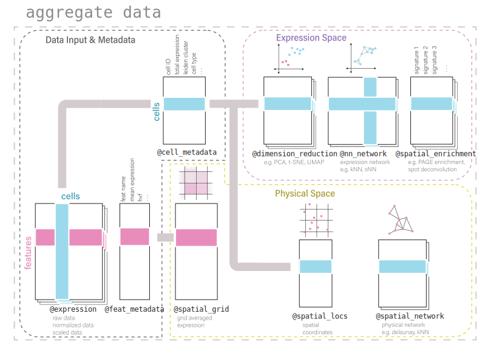

# How to create a Giotto Object?

#### 1. Minimum requirements
 - expression matrix
 - spatial locations (*unnecessary for scRNAseq analysis*)    

```{r eval=FALSE, include=TRUE}
library(Giotto)

# 1. Directly from file path (dummy locations are used as examples here)
path_to_expression_file = "/local/path/to/expression/file.txt"
path_to_locations_file = "/local/path/to/locations/file.txt"

my_giotto_object = createGiottoObject(expression = path_to_expression_file,
                                      spatial_locs = path_to_locations_file)

# 2. Use objects already loaded into environment
expression_matrix = readExprMatrix(path = path_to_expression_file) # fast method to read expression matrix
cell_locations = data.table::fread(file = path_to_locations_file)

my_giotto_object = createGiottoObject(expression = expression_matrix,
                                      spatial_locs = cell_locations)
```

<details>
<summary>Expression file formatting</summary>    
<br>
Expression count matrices accepted by Giotto should have columns correlating to individual cells (**cell IDs**) and rows to individual features (**feature IDs**).    
**data.table** objects and text-based files ie: (**.csv, .tsv, .txt**) to be read in should have column 1 be **feature IDs**.    

| |feat_ID| Cell_1| Cell_2| Cell_3| ...|  
|-|:------|-------|-------|-------|----|
|1|Gene1  |       |       |       |    |  
|2|Gene2  |       |       |       |    | 
|3|Gene3  |       |       |       |    | 
| |...    |       |       |       |    | 

<br>
**matrix** and **DelayedMatrix** objects should have **feature IDs** already incorporated as the rownames.    

|       | Cell_1| Cell_2| Cell_3| ...|  
|:------|-------|-------|-------|----|
|Gene1  |       |       |       |    |  
|Gene2  |       |       |       |    | 
|Gene3  |       |       |       |    | 
|...    |       |       |       |    | 

</details>    
<details>
<summary>Locations file formatting</summary>
<br>
Numerical columns will be interpreted in order of x, y, and (optionally) z coordinate. The first non-numerical column will be taken as **cell IDs**

| | sdimx| sdimy| sdimz| cell_ID|
|-|------|------|------|--------|
|1|      |      |      |        |
|2|      |      |      |        |
|3|      |      |      |        |
| |      |      |      |        |

</details>    
    

**\*Note:** multiple expression files during can be given at once during Giotto object creation by using a named list.
```{r eval=FALSE, include=TRUE}
my_giotto_object = createGiottoObject(expression = list(raw = matrix1
                                                        scaled = matrix2,
                                                        custom = matrix3),
                                      spatial_locs = cell_locations)
```
<br>

#### 2. Additional features
Other information can also be provided using the other function parameters    
- add **cell** or **gene metadata**    
- add **spatial networks** or **grids**    
- add **dimension reduction**    
- add **images**    
- add **instructions**    

Usually specifying your own **instructions** can be most useful to:    
- specify a python path     
- determine output of plots (show in viewer, return as object, save as image)    
- automatically save plots to selected directory    

```{r eval=FALSE, include=TRUE}
library(Giotto)

# 1. Directly from file path (dummy locations are used as examples here)
path_to_expression_file = "/local/path/to/expression/file.txt"
path_to_locations_file = "/local/path/to/locations/file.txt"

# 2. Create your own instructions
path_to_python = '/usr/bin/python3' # can be something else
working_directory = getwd() # this will use your current working directory
my_instructions = createGiottoInstructions(python_path = path_to_python,
                                           save_dir = working_directory)

# 3. Create your giotto object
my_giotto_object = createGiottoObject(expression = path_to_expression_file,
                                      spatial_locs = path_to_locations_file,                                      
                                      cell_metadata = my_cell_metadata,
                                      gene_metadata = my_gene_metadata,
                                      instructions = my_instructions)

# 4. check which giotto instructions are associated with your giotto object
showGiottoInstructions(my_giotto_object)
```
<br>


# Giotto Object Structure
<br>
Usage of the Giotto package revolves around the **giottoObject**. This is an S4 object class that holds spatial expression data and facilitates its use with the Giotto package's functions. Additional metadata and other certain outputs generated from Giotto functions that are used in downstream analyses will also be stored within this object. The self-contained nature of the Giotto object makes it a convenient representation of the entire spatial experiment and is why many of Giotto functions both take the **giottoObject** as input and feed into it as output.    

Data is organized within the **giottoObject** in defined **slots** as described in the diagram below.    
<br>
{width=100%}  
{width=100%}  
{width=100%}  
    
## Nested organization within slots    
Spatial data has a tiered organization and so does Giotto. Tissue regions can be divided down into individual cells and then further into organelles. 
The data structure of Giotto mirrors biological structure by nesting data within slots related to spatial data by **spat_unit** (spatial unit). 
Additonally, to facilitate the integration of multiple omic data, slots related to feature data will be nested with **feat_type** (feature type).
<br>    
Included below is a description of this nesting and also, for advanced users and contributors/developers, accessor functions for the slots are also provided.
<br>    
    
```{r include=FALSE}
# Code snippet from https://bookdown.org/yihui/rmarkdown-cookbook/font-color.html
colorize <- function(x, color) {
  if (knitr::is_latex_output()) {
    sprintf("\\textcolor{%s}{%s}", color, x)
  } else if (knitr::is_html_output()) {
    sprintf("<span style='color: %s;'>%s</span>", color,
      x)
  } else x
}
```


### Slots and Subnesting    
Slot                       Nested                                                                                                                                  Example                                                                                                                                                            Accessors
------------------------   -------------------------------------------------------------------------------------------------------------------------------------   ---------------------------------------------------------------------------------------------------------------------------------------------------------------    -----------------------------------------------------------------------------------
**@expression**            `r colorize("spat_unit", "#4C94A0")`-`r colorize("feat_type", "#E88EBB")`-`r colorize("name", "#801C34")`                               `r colorize("cell", "#4C94A0")`-`r colorize("rna", "#E88EBB")`-`r colorize("raw", "#801C34")`                                                                      get_expression_values()<br>set_expression_values()<br>showGiottoExpression()
**@cell_metadata**         `r colorize("spat_unit", "#4C94A0")`-`r colorize("feat_type", "#E88EBB")`                                                               `r colorize("cell", "#4C94A0")`-`r colorize("rna", "#E88EBB")`                                                                                                     pDataDT()<br>addCellMetadata()
**@feat_metadata**         `r colorize("spat_unit", "#4C94A0")`-`r colorize("feat_type", "#E88EBB")`                                                               `r colorize("cell", "#4C94A0")`-`r colorize("rna", "#E88EBB")`                                                                                                     fDataDT()<br>addFeatMetadata()
**@spatial_grid**          `r colorize("spat_unit", "#4C94A0")`-`r colorize("feat_type", "#E88EBB")`                                                               `r colorize("cell", "#4C94A0")`-`r colorize("rna", "#E88EBB")`                                                                                                     get_spatialGrid()<br>set_spatialGrid()<br>showGiottoSpatGrids()
**@nn_network**            `r colorize("spat_unit", "#4C94A0")`-`r colorize("method", "#F6851F")`-`r colorize("name", "#801C34")`                                  `r colorize("cell", "#4C94A0")`-`r colorize("SNN", "#F6851F")`-`r colorize("SNN_results1", "#801C34")`                                                             get_NearestNetwork()<br>set_NearestNetwork()
**@dimension_reduction**   `r colorize("spat_unit", "#4C94A0")`-`r colorize("method", "#F6851F")`-`r colorize("name", "#801C34")`                                  `r colorize("cell", "#4C94A0")`-`r colorize("PCA", "#F6851F")`-`r colorize("pca_results1", "#801C34")`                                                             get_dimReduction()<br>set_dimReduction()<br>showGiottoDimRed()
**@spatial_enrichment**    `r colorize("spat_unit", "#4C94A0")`-`r colorize("name", "#801C34")`                                                                    `r colorize("cell", "#4C94A0")`-`r colorize("results1", "#801C34")`                                                                                                get_spatial_enrichment()<br>set_spatial_enrichment()<br>showGiottoSpatEnrichments()
**@spatial_info**          `r colorize("spat_unit", "#4C94A0")`                                                                                                    `r colorize("cell", "#4C94A0")`                                                                                                                                    get_polygon_info()<br>set_polygon_info()<br>showGiottoSpatialInfo()
**@spatial_locs**          `r colorize("spat_unit", "#4C94A0")`-`r colorize("name", "#801C34")`                                                                    `r colorize("cell", "#4C94A0")`-`r colorize("raw", "#801C34")`                                                                                                     get_spatial_locations()<br>set_spatial_locations()<br>showGiottoSpatLocs()
**@spatial_network**       `r colorize("spat_unit", "#4C94A0")`-`r colorize("name", "#801C34")`                                                                    `r colorize("cell", "#4C94A0")`-`r colorize("Delaunay_network1", "#801C34")`                                                                                       get_spatialNetwork()<br>set_spatialNetwork()<br>showGiottoSpatNetworks()
**@feat_info**             `r colorize("feat_type", "#E88EBB")`                                                                                                    `r colorize("rna", "#E88EBB")`                                                                                                                                     get_feature_info()<br>set_feature_info()<br>showGiottoFeatInfo()
**@images**                `r colorize("name", "#801C34")`                                                                                                         `r colorize("image", "#801C34")`                                                                                                                                   getGiottoImage()<br>addGiottoImage()<br>showGiottoImageNames()
**@largeImages**           `r colorize("name", "#801C34")`                                                                                                         `r colorize("image", "#801C34")`                                                                                                                                   getGiottoImage()<br>addGiottoImage()<br>showGiottoImageNames()
**@instructions**                                                                                                                                                                                                                                                                                                                     replaceGiottoInstructions()<br>showGiottoInstructions()
**@OS_platform**    
**@join_info**    
**@parameters** 
------------------------   -------------------------------------------------------------------------------------------------------------------------------------   ---------------------------------------------------------------------------------------------------------------------------------------------------------------   -----------------------------------------------------------------------------------


